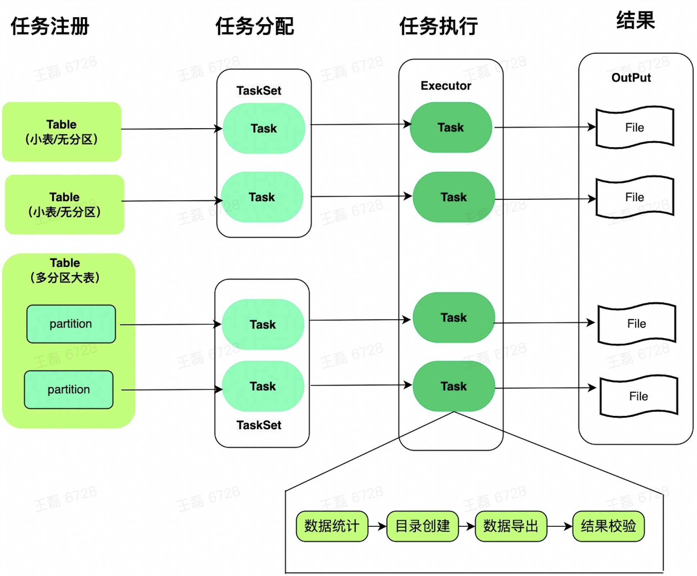

#### 核心原理



1. ##### 用户在config.py中配置任务。

具体参数解释如下

```
export_table_list = [
    {
      "db":"default",#要同步的表所在的数据库
      "table":"trips",#要同步的表
      "mode":"partition",#同步方式：all：全表一次性同步，partition按照分区同步
      "partition_expr":"toYYYYMM(pickup_date)", #partition表达式，任务会按照该表达式将数据统计到不同分区，并按照分区导出
      "upper_condition":"toYYYYMM(pickup_date)<=201508",#导出数据的上限，用于判定哪些数据属于历史数据
      "lower_condition":"toYYYYMM(pickup_date)>=201506",#导出数据的下限，用于判定哪些过早的历史数据不在需要
      "split_filed": "pickup_date"#对数据量过大的partition按照split_filed再次切分
    },{
      "db":"default",
      "table":"trips_np",
      "mode":"all",
      "partition_expr":"",#all模式下为空
      "upper_condition":"",#all模式下为空
      "lower_condition":""#all模式下为空
    }
]

#使用ClickHouse 客户端连接ClickHouse的命令
#example :./clickhouse-client --host=<host> --port=<port> --user=<user> --password=<password>;
clickhouse_connect_command = "/Users/alex/Documents/dev/evn/clickhouse/clickhouse  --client --host=127.0.0.1 --port=9000 "
#使用多少个线程导出数据
#2.thread number use
process_number = 10
#ClickHouse的user_files地址，因为ClickHouse读取文件查询的时候需要安全验证，放在user_files下主要是为了保障ClickHouse能正常读取
user_files_path = "/Users/alex/Documents/dev/evn/clickhouse/user_files"
```

2. ##### 任务拆分和调度

   1. 对于model为all的任务，一个表生成一个Task。

   2. 对于model为partition的任务，按照partition_expr对数据进行分组。对每个组内的数据生成一个Task。
   3. 根据需要导出的数据总量和线程个数，计算每个线程应该分配的Task个数，并组成一个Taskset
   4. 将Taskset任务提交给Task运行。

3. ##### Taskset执行逻辑

   1. 循环遍历TaskSet中的每个Task，并执行该Task，每个Task执行后会产生一个文件，目前指定CSV文件。
   2. Task的执行过程中会经历：创建目录->数据导出->数据校验->日志打印
   3. 所有Task支持完成后主进程退出，任务完成。

   

#### 存在问题

1. 分区文件超过50GB会报写入异常。引起在迁移前先在system.parts中查看分区中数据的大小。

2. 后续会对分区进行进一步的切分，计划只支持到按照时间列切分，每10000万条数据滚动生成一个文件。

   

#### 相关命令：

1. 如果没有ClickHouse客户端，则只有该命令安装clickhouse，安装完成会ClickHouse 客户端也会随之安装上 
  curl https://clickhouse.com/ | sh
2. 分区数据查看

  ```
  SELECT 
   'trips' as `table_name`,
   partition AS `partition_name`,
   sum(rows) AS `total_num`,
   (sum(data_compressed_bytes))/(1024*1024*1024) AS `compressed_size`
  FROM system.parts
  WHERE (database IN ('default')) AND (table IN ('trips'))
  GROUP BY partition 
  ORDER BY partition ASC;
  ```

  

